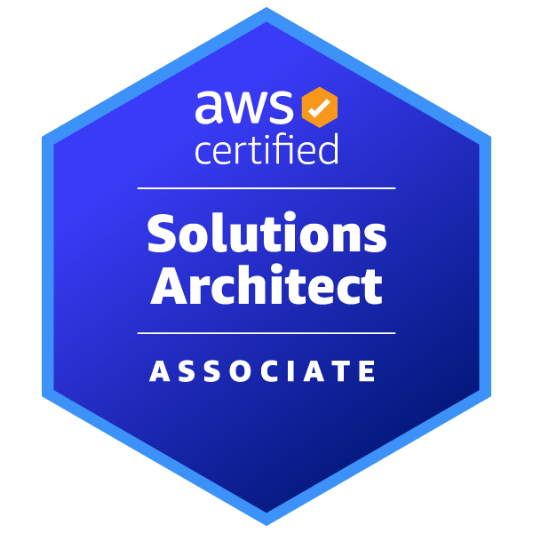
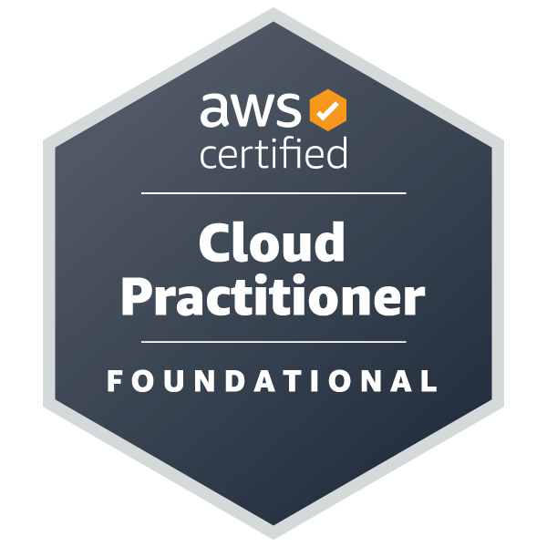

## Socials

[<picture><source media="(prefers-color-scheme: dark)" srcset="./assets/social/github-dark.svg"></picture>](https://github.com/koki-develop)
[<picture><source media="(prefers-color-scheme: dark)" srcset="./assets/social/x-dark.svg"></picture>](https://twitter.com/koki_develop)

## Skills

## Certifications

